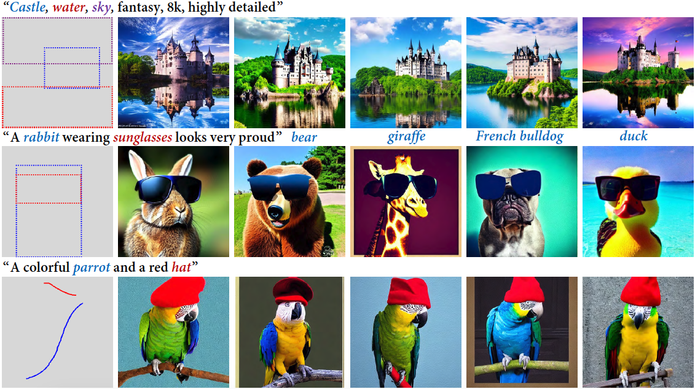

<div align="center">
<h1>BoxDiff 🎨 (ICCV 2023)</h1>
<h3>BoxDiff: Text-to-Image Synthesis with Training-Free Box-Constrained Diffusion</h3>

[Jinheng Xie](https://sierkinhane.github.io/)<sup>1</sup>&nbsp; Yuexiang Li<sup>2</sup>&nbsp; Yawen Huang<sup>2</sup>&nbsp; Haozhe Liu<sup>2,3</sup>&nbsp; Wentian Zhang<sup>2</sup> Yefeng Zheng<sup>2</sup>&nbsp; [Mike Zheng Shou](https://scholar.google.com/citations?hl=zh-CN&user=h1-3lSoAAAAJ&view_op=list_works&sortby=pubdate)<sup>1</sup> 

<sup>1</sup> National University of Singapore&nbsp; <sup>2</sup> Tencent Jarvis Lab&nbsp; <sup>3</sup> KAUST

[](https://arxiv.org/abs/2307.10816)

</div>


### BoxDiff-SD-XL
[A BoxDiff implementation based on SD-XL](https://github.com/Cominclip/BoxDiff-XL)

### Integration in diffusers
Thanks to [@zjysteven](https://github.com/zjysteven) for his efforts. Below shows an example with `stable-diffusion-2-1-base`.
```
import torch
from PIL import Image, ImageDraw
from copy import deepcopy

from examples.community.pipeline_stable_diffusion_boxdiff import StableDiffusionBoxDiffPipeline

def draw_box_with_text(img, boxes, names):
    colors = ["red", "olive", "blue", "green", "orange", "brown", "cyan", "purple"]
    img_new = deepcopy(img)
    draw = ImageDraw.Draw(img_new)

    W, H = img.size
    for bid, box in enumerate(boxes):
        draw.rectangle([box[0] * W, box[1] * H, box[2] * W, box[3] * H], outline=colors[bid % len(colors)], width=4)
        draw.text((box[0] * W, box[1] * H), names[bid], fill=colors[bid % len(colors)])
    return img_new

pipe = StableDiffusionBoxDiffPipeline.from_pretrained(
    "stabilityai/stable-diffusion-2-1-base",
    torch_dtype=torch.float16,
)
pipe.to("cuda")

# example 1
prompt = "as the aurora lights up the sky, a herd of reindeer leisurely wanders on the grassy meadow, admiring the breathtaking view, a serene lake quietly reflects the magnificent display, and in the distance, a snow-capped mountain stands majestically, fantasy, 8k, highly detailed"
phrases = [
    "aurora",
    "reindeer",
    "meadow",
    "lake",
    "mountain"
]
boxes = [[1,3,512,202], [75,344,421,495], [1,327,508,507], [2,217,507,341], [1,135,509,242]]

# example 2
# prompt = "A rabbit wearing sunglasses looks very proud"
# phrases = ["rabbit", "sunglasses"]
# boxes = [[67,87,366,512], [66,130,364,262]]

boxes = [[x / 512 for x in box] for box in boxes]

images = pipe(
    prompt,
    boxdiff_phrases=phrases,
    boxdiff_boxes=boxes,
    boxdiff_kwargs={
        "attention_res": 16,
        "normalize_eot": True
    },
    num_inference_steps=50,
    guidance_scale=7.5,
    generator=torch.manual_seed(42),
    safety_checker=None
).images

draw_box_with_text(images[0], boxes, phrases).save("output.png")
```

### Setup
Note that we only test the code using PyTorch==1.12.0. You can build the environment via `pip` as follow: 
```
pip3 install -r requirements.txt
```
To apply BoxDiff on GLIGEN pipeline, please install diffusers as follow:
``` 
git clone git@github.com:gligen/diffusers.git
pip3 install -e .
```
 
### Usage
To add spatial control on the Stable Diffusion model, you can simply use `run_sd_boxdiff.py`. For example:
```
CUDA_VISIBLE_DEVICES=0 python3 run_sd_boxdiff.py --prompt "as the aurora lights up the sky, a herd of reindeer leisurely wanders on the grassy meadow, admiring the breathtaking view, a serene lake quietly reflects the magnificent display, and in the distance, a snow-capped mountain stands majestically, fantasy, 8k, highly detailed" --P 0.2 --L 1 --seeds [1,2,3,4,5,6,7,8,9,10,11,12,13,14,15,16,17,18,19,21,22,23,24,25,26,27,28,29,30] --token_indices [3,12,21,30,46] --bbox [[1,3,512,202],[75,344,421,495],[1,327,508,507],[2,217,507,341],[1,135,509,242]] --refine False
```
or another example:
``` 
CUDA_VISIBLE_DEVICES=0 python3 run_sd_boxdiff.py --prompt "A rabbit wearing sunglasses looks very proud"  --P 0.2 --L 1 --seeds [1,2,3,4,5,6,7,8,9] --token_indices [2,4] --bbox [[67,87,366,512],[66,130,364,262]]
```
Note that you can specify the token indices as the indices of words you want control in the text prompt and one token index has one corresponding conditoning box. `P` and `L` are hyper-parameters for the proposed constraints.

When `--bbox` is not specified, there is a interface to draw bounding boxes as conditions.
``` 
CUDA_VISIBLE_DEVICES=0 python3 run_sd_boxdiff.py --prompt "A rabbit wearing sunglasses looks very proud"  --P 0.2 --L 1 --seeds [1,2,3,4,5,6,7,8,9] --token_indices [2,4]
```

To add spatial control on the GLIGEN model, you can simply use `run_gligen_boxdiff.py`. For example:
``` 
CUDA_VISIBLE_DEVICES=0 python3 run_gligen_boxdiff.py --prompt "A rabbit wearing sunglasses looks very proud" --gligen_phrases ["a rabbit","sunglasses"] --P 0.2 --L 1 --seeds [1,2,3,4,5,6,7,8,9] --token_indices [2,4] --bbox [[67,87,366,512],[66,130,364,262]] --refine False
```

The direcory structure of synthetic results are as follows:
```
outputs/
|-- text prompt/
|   |-- 0.png 
|   |-- 0_canvas.png 
|   |-- 1.png
|   |-- 1_canvas.png 
|   |-- ...
```


### Customize Your Layout
[VisorGPT](https://github.com/Sierkinhane/VisorGPT) can customize layouts as spatial conditions for image synthesis using BoxDiff.

### Citation
``` 
@InProceedings{Xie_2023_ICCV,
    author    = {Xie, Jinheng and Li, Yuexiang and Huang, Yawen and Liu, Haozhe and Zhang, Wentian and Zheng, Yefeng and Shou, Mike Zheng},
    title     = {BoxDiff: Text-to-Image Synthesis with Training-Free Box-Constrained Diffusion},
    booktitle = {Proceedings of the IEEE/CVF International Conference on Computer Vision (ICCV)},
    year      = {2023},
    pages     = {7452-7461}
}
```

Acknowledgment - the code is highly based on the repository of [diffusers](https://github.com/huggingface/diffusers), [google](https://github.com/google/prompt-to-prompt), and [yuval-alaluf](https://github.com/yuval-alaluf).
